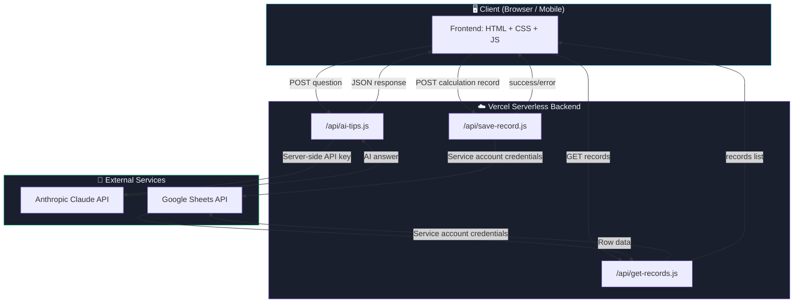
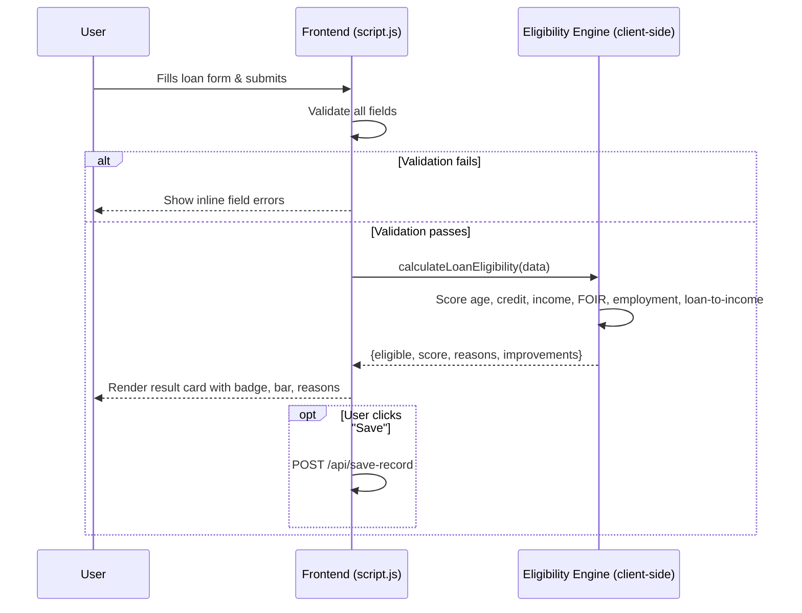
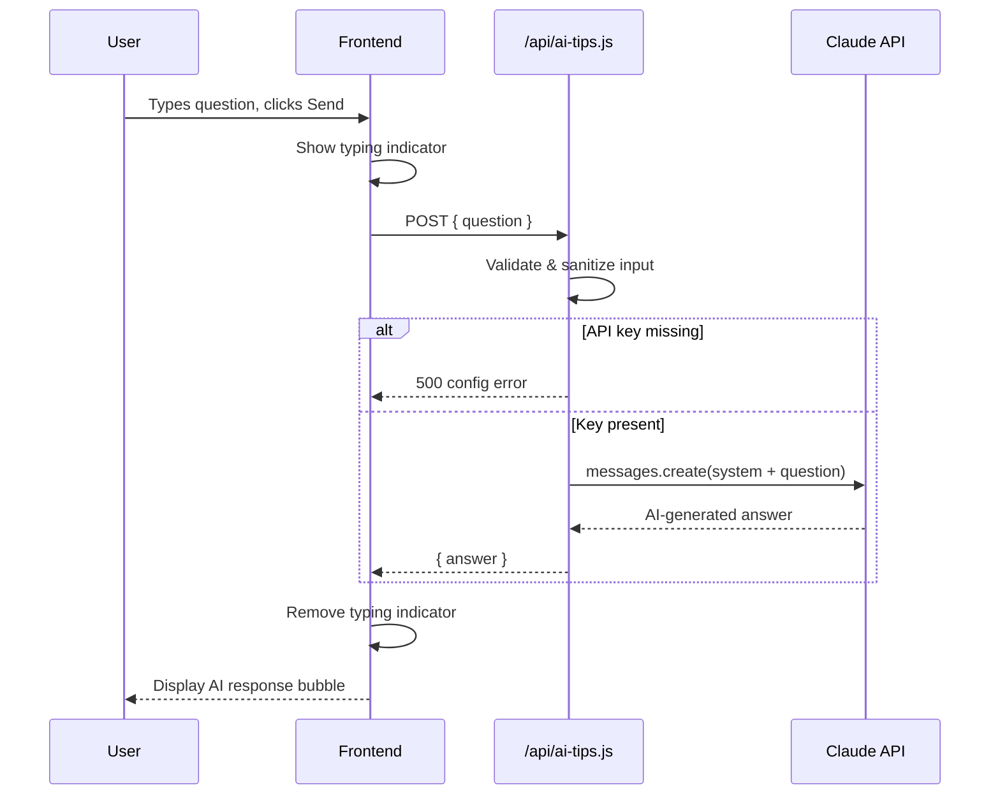
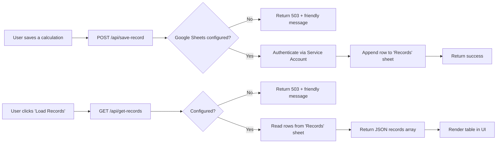

# 💠 AI Loan Eligibility Checker — Smart BFSI Financial Assistant

**A NASSCOM Capstone Project**

An AI-powered BFSI (Banking, Financial Services & Insurance) web platform
that helps users make informed personal financial decisions through four
integrated modules: Loan Eligibility Checker, Credit Score Analyzer, EMI
Calculator, and AI Financial Tips (powered by Anthropic's Claude API).

> ⚠️ **Educational Project Disclaimer:** This platform provides
> educational estimations only. It does not connect to real banks,
> credit bureaus, or financial institutions, and must not be treated as
> financial, legal, or investment advice, or as an actual loan approval.

---

## Table of Contents

1. [Project Overview](#project-overview)
2. [Problem Statement](#problem-statement)
3. [Objectives](#objectives)
4. [Features](#features)
5. [Technology Stack](#technology-stack)
6. [System Architecture](#system-architecture)
7. [Folder Structure](#folder-structure)
8. [Installation](#installation)
9. [Environment Variables Setup](#environment-variables-setup)
10. [Google Sheets Setup](#google-sheets-setup)
11. [Claude API Setup](#claude-api-setup)
12. [Running Locally](#running-locally)
13. [Deployment](#deployment)
14. [Testing](#testing)
15. [System Workflow & Data Flow](#system-workflow--data-flow)
16. [Module Descriptions](#module-descriptions)
17. [Future Enhancements](#future-enhancements)
18. [Project Checklist](#project-checklist)

---

## Project Overview

Many students, first-time earners, and small business owners in India
struggle to understand whether they qualify for a loan, what their
credit score means, or how much a loan will actually cost them each
month. Bank websites are often confusing, and professional financial
advice isn't always accessible. This project bridges that gap with a
simple, transparent, AI-assisted financial literacy tool.

## Problem Statement

There is no easy, free, and transparent way for an average person to:
- Estimate their loan eligibility before formally applying
- Understand what their credit score category actually means
- Calculate accurate EMI figures for different loan scenarios
- Get instant, beginner-friendly answers to common finance questions

## Objectives

- Build a transparent, rule-based loan eligibility estimator
- Educate users about credit score categories and risk factors
- Provide an accurate, real-time EMI calculator
- Integrate Claude AI for personalized financial guidance
- Securely store and retrieve user calculation history using Google Sheets
- Demonstrate secure API key handling and BFSI-appropriate UX

## Features

- 🏦 **Loan Eligibility Checker** — deterministic, weighted scoring engine
- 📊 **Credit Score Analyzer** — 5-tier categorization with risk indicators
- 🧮 **EMI Calculator** — real-time EMI, interest, and repayment breakdown
- 🤖 **AI Financial Tips** — Claude-powered financial Q&A assistant
- 📁 **Record Storage** — Google Sheets-backed calculation history
- 🎨 **Modern dark glassmorphism UI** — responsive, mobile-first design

## Technology Stack

| Layer | Technology |
|-------|------------|
| Frontend | HTML5, CSS3, Vanilla JavaScript |
| Backend (Production) | Node.js serverless functions (Vercel) |
| Backend (Alternative/local) | Python 3 + Flask |
| AI | Anthropic Claude API (`claude-sonnet-4-6`) |
| Data Storage | Google Sheets API (Service Account) |
| Version Control | Git / GitHub |
| Deployment | Vercel (primary) or Netlify (frontend + Functions) |

---

## System Architecture



**Key security principle:** the browser never talks directly to Claude
or Google Sheets. It only ever calls Claude's own `/api/*` serverless
functions, which hold the real secrets server-side.

---

## Folder Structure

```
loan-eligibility-checker/
│
├── frontend/
│   ├── index.html          # All 4 module views + dashboard
│   ├── style.css           # Dark glassmorphism theme
│   └── script.js           # Validation, calculations, API calls
│
├── api/                     # Vercel serverless functions (Node.js)
│   ├── ai-tips.js           # Claude API proxy (secure)
│   ├── save-record.js       # Google Sheets: append record
│   ├── get-records.js       # Google Sheets: read records
│   └── _googleSheets.js     # Shared auth helper (not a route)
│
├── backend/                 # Optional Python alternative backend
│   ├── server.py            # Flask mirror of the same 3 endpoints
│   └── requirements.txt
│
├── tests/
│   └── run-tests.js         # Automated EMI & credit score tests
│
├── documentation/
│   └── (architecture notes, diagrams — see this README)
│
├── .env.example             # Template for required secrets
├── .gitignore
├── package.json
├── vercel.json               # Vercel routing configuration
├── README.md
└── TESTING.md
```

---

## Installation

### Prerequisites
- [Node.js](https://nodejs.org/) v18 or later
- [Git](https://git-scm.com/)
- A free [Vercel](https://vercel.com/) account (for deployment)
- (Optional) Python 3.9+ if you want to run the Flask alternative backend

### Clone and install

```bash
git clone https://github.com/YOUR_USERNAME/loan-eligibility-checker.git
cd loan-eligibility-checker
npm install
```

### (Optional) Python backend setup

```bash
cd backend
pip install -r requirements.txt
```

---

## Environment Variables Setup

1. Copy the example file:
   ```bash
   cp .env.example .env
   ```
2. Fill in your real values in `.env` (this file is git-ignored and will
   never be committed).
3. In production, add the same variables in **Vercel → Project Settings
   → Environment Variables**.

Required variables:

| Variable | Purpose |
|----------|---------|
| `ANTHROPIC_API_KEY` | Authenticates requests to Claude API |
| `GOOGLE_SERVICE_ACCOUNT_EMAIL` | Service account identity for Sheets access |
| `GOOGLE_PRIVATE_KEY` | Service account private key (keep `\n` escaped) |
| `GOOGLE_SHEET_ID` | Target spreadsheet ID to read/write records |

**Never commit a real `.env` file.** It is already listed in `.gitignore`.

---

## Google Sheets Setup

1. Go to [Google Cloud Console](https://console.cloud.google.com/) and
   create (or select) a project.
2. Enable the **Google Sheets API** for that project.
3. Go to **IAM & Admin → Service Accounts → Create Service Account**.
4. Generate a **JSON key** for the service account and download it.
5. From the JSON file, copy:
   - `client_email` → `GOOGLE_SERVICE_ACCOUNT_EMAIL`
   - `private_key` → `GOOGLE_PRIVATE_KEY` (keep the `\n` sequences as-is)
6. Create a new Google Sheet. Copy its ID from the URL:
   `https://docs.google.com/spreadsheets/d/`**`SHEET_ID`**`/edit`
7. Rename the first tab to exactly `Records`.
8. Add this header row (row 1) to the `Records` tab:
   ```
   timestamp | type | age | income | employmentType | creditScore | category | risk | loanAmount | loanTenure | annualRate | tenureMonths | existingEmi | eligibilityResult | eligibilityScore | emiResult | totalInterest | totalRepayment
   ```
9. Click **Share** on the sheet and give **Editor** access to the
   service account's email address (the `client_email`).

If these credentials are not configured, the app will still run — the
Loan/Credit/EMI/AI tools work fully, and only the "Save record" /
"Load Records" features will show a friendly configuration message.

---

## Claude API Setup

1. Create an account at [console.anthropic.com](https://console.anthropic.com/).
2. Generate an API key from the console.
3. Set it as `ANTHROPIC_API_KEY` in your `.env` file (local) and in
   Vercel's Environment Variables (production).
4. The key is used **only** inside `api/ai-tips.js` (or
   `backend/server.py`), never in any frontend file.

---

## Running Locally

### Option A: Node.js serverless functions (recommended, matches production)

```bash
npm install -g vercel   # one-time
vercel dev
```

This runs the frontend and the `/api/*.js` functions together, exactly
as they'll behave on Vercel. Visit the printed local URL (typically
`http://localhost:3000`).

### Option B: Python Flask backend (alternative)

```bash
cd backend
pip install -r requirements.txt
python server.py
```

Visit `http://localhost:5000`. This serves the frontend and mirrors the
same three API endpoints using Flask instead of Node.js.

---

## Deployment

### Deploying to Vercel (recommended)

1. Push your project to a GitHub repository.
2. Go to [vercel.com/new](https://vercel.com/new) and import the repo.
3. Vercel will detect `vercel.json` automatically.
4. Add all four environment variables (see above) under **Project
   Settings → Environment Variables**.
5. Click **Deploy**. Vercel builds the static frontend and deploys each
   file in `/api` as an individual serverless function.

### Deploying to Netlify (alternative)

1. Push to GitHub, then import the repo in Netlify.
2. Set the **Publish directory** to `frontend`.
3. Convert `/api` functions to Netlify Functions format (place them in
   `netlify/functions/` — the internal logic is nearly identical; only
   the `exports.handler` signature differs slightly from Vercel's).
4. Add the same environment variables under **Site Settings →
   Environment Variables**.

---

## Testing

See [TESTING.md](./TESTING.md) for the full list of test cases covering
EMI calculations, loan eligibility logic, credit score categorization,
form validation, AI/network failure handling, Google Sheets failures,
and mobile responsiveness.

Run the automated calculation tests:

```bash
node tests/run-tests.js
```

---

## System Workflow & Data Flow

### Loan Eligibility Flow



### AI Financial Tips Flow



### Record Storage Flow



---

## Module Descriptions

### 1. Loan Eligibility Checker
A fully client-side, deterministic scoring engine (see
`calculateLoanEligibility()` in `script.js`) that weighs six factors —
age, credit score, income, debt-to-income ratio (FOIR), employment
stability, and loan-to-income ratio — into a transparent 0–100 score.
Every contributing reason and improvement suggestion is generated from
the actual input values, so results are explainable, not a black box.

### 2. Credit Score Analyzer
Maps a user-entered score (300–900) into one of five standard bands
(Poor, Fair, Good, Very Good, Excellent), each with a plain-language
interpretation, a risk badge, common contributing factors, and concrete
improvement suggestions.

### 3. EMI Calculator
Implements the standard EMI formula `EMI = P × R × (1+R)^N / ((1+R)^N − 1)`
in real time as the user types, showing monthly EMI, total interest, and
total repayment, plus a visual principal-vs-interest bar.

### 4. AI Financial Tips
A chat-style interface where user questions are sent to a secure backend
endpoint, which calls Claude with a finance-education system prompt and
returns a beginner-friendly, disclaimer-appended answer.

### 5. Record Storage (Google Sheets)
Any of the three calculators can save their result as a row in a
connected Google Sheet via a secure backend endpoint, and previously
saved records can be retrieved and viewed in a table.

---

## API Flow Explanation

All three backend endpoints follow the same secure pattern:

1. **Frontend** sends a JSON request to `/api/<endpoint>` — never
   directly to Claude or Google.
2. **Serverless function** validates/sanitizes the input.
3. Function reads secrets **only** from `process.env.*`.
4. Function calls the external API (Claude or Google Sheets) using
   those secrets.
5. Function returns a clean JSON response (or a safe, generic error
   message — internal error details and secrets are never leaked to
   the client).

---

## Future Enhancements

- 🔐 User authentication (so records are scoped per user, not global)
- 🤖 Real ML-based loan prediction model (trained on anonymized data)
- 📄 PDF financial report generation for each session
- 🏦 Real bank API integrations (Account Aggregator framework, etc.)
- 📊 Real credit bureau integration (CIBIL/Experian APIs, with consent)
- 📈 Advanced financial dashboards with spending/saving trend charts
- 🎯 Personalized financial planning & goal tracking
- 🌐 Multi-language support (Hindi, regional languages)
- 🎙️ Voice-based financial assistant

---

## Project Checklist

- [x] Frontend complete
- [x] Loan eligibility complete
- [x] Credit analyzer complete
- [x] EMI calculator complete
- [x] Claude AI complete
- [x] Google Sheets complete
- [x] Security configured
- [x] Testing complete
- [x] GitHub ready
- [x] Deployment ready

---

## License & Disclaimer

This is an academic capstone project built for educational purposes as
part of a NASSCOM program. It does not provide real financial, legal, or
investment advice, and is not affiliated with any bank or credit bureau.
